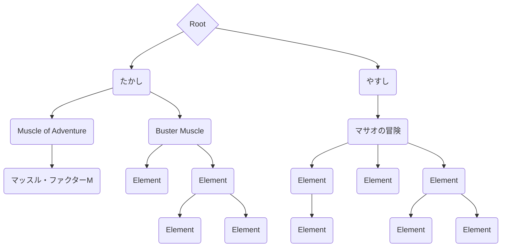
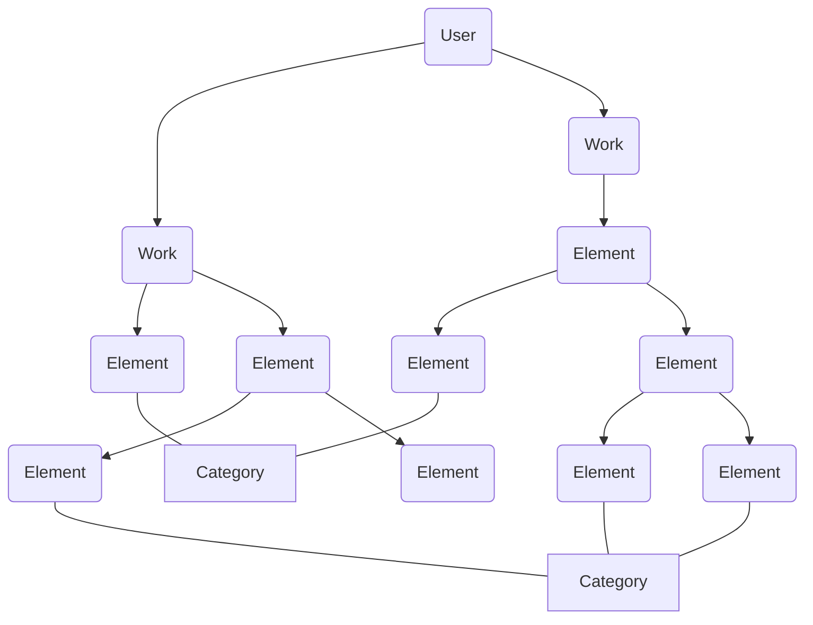

# SoursARC Content Documentation

## 概要
SoursARCのコンテンツ構造を定義するドキュメント。

---

## Contentの種類

### User
- **説明**: SoursARCのユーザ。創作物を作成する主体。
- **例**:
  - `TunaMayoDX4`
  - `Takashi`
  - `John`

#### メンバ
- user_id_string : ユーザの識別名(string)
- display_name: ユーザの表示名(string)
- introduction : 自己紹介(string)
- like_genre : ユーザの好むジャンル([string])
- gen_genre : ユーザの好むジャンル(AI選択)([string])
- works: 配下の創作物のID([integer])

---

### Work
- **説明**: ユーザが作成した創作物。  
  子要素として`Element`や`Genre`を持ち、ネストすることはできない。  
  公開設定(公開/非公開)を持ち、いずれ範囲公開なども実装予定。
- **例**:
  - `TunaMayoDX4/Dawn of EverNight`
  - `Takashi/Adventure of Muscle`

#### メンバ
- author : 作者のID(integer)
- name : 創作物の名前(string)
- summary : 創作物の要約(string)
- genres : 創作物のジャンルのID([integer])
- elements : 配下の要素のID([integer])
- folder : 配下のフォルダのID(integer)

---

### Element
- **説明**: Workの配下につく要素。  
  子要素として`Element`と`Category`を持つことができ、ネスト可能。
- **例**:
  - `TunaMayoDX4/Dawn of EverNight/Character`
  - `TunaMayoDX4/Dawn of EverNight/Character/Hagiri-Kanami`

#### メンバ
- parent : 親要素のID(integer)
- depth : 要素の深度(integer)
- name : 要素の名前(string)
- summary : 要素の要約(string)
- categoris : 要素のカテゴリのID([integer])
- elements : 配下の要素のID([integer])
- folder : 配下のフォルダのID(integer)

---

### Genre
- **説明**: Workに紐づけられたジャンル。  
  ユーザが作成した創作物に対してジャンルを指定可能。  
  Genreはグローバルに共有され、ユーザ1人あたり32個までのGenreを作れる。
- **例**:
  - `TunaMayoDX4/Dawn of EverNight:Science Fiction`
  - `Takashi/Adventure of Muscle:Action`

---

### Category
- **説明**: Elementに紐づけられたカテゴリ。  
  Elementは垂直方向の参照を持つのに対して、Categoryは水平方向の参照を支援する。  
  Categoryはローカルに扱われる。
- **例**:
  - `TunaMayoDX4/Dawn of EverNight/Character:Character-List`
  - `TunaMayoDX4/Dawn of EverNight/Character/Hagiri-Kanami:Scientist`

---

### Folder
- **説明**: Documentを纏めるためのフォルダ。  
  ContentはFolderを必ず1つ持ち、ネスト可能。  
  通常のフォルダと時系列フォルダがある。
- **例**:
  - `TunaMayoDX4/Dawn of EverNight:Story/Season1`
  - `TunaMayoDX4/Dawn of EverNight:Story/Season1/Chapter1`

---

### Document
- **説明**: User, Work, Elementに紐づけられたドキュメント。  
  タイトルと本文を最低限持ち、ストーリーとして扱うことができる。
- **例**:
  - `TunaMayoDX4/Dawn of EverNight:Story/Season1/Chapter1:#0001 はじまり`
  - `Takashi/Adventure of Muscle:#0001 筋肉の脈動`

---

## Contentの識別に使うキー

`u64`などの数値列を使用。

---

## テーブル構造について

### User

Root配下にUserテーブルが形成される。

### Work

[UserID]を名称に持つWorkテーブルが形成される。

### Element

[UserID][WorkID]を名称に持つElementテーブルが形成される。
Workに所属するすべてのElementはこの配下に作られるが、論理的にツリー構造を作る。

---

Root -> User -> Work -> Elementの関係性イメージ図

User -> Work -> Element -- Category の関係性イメージ図

---